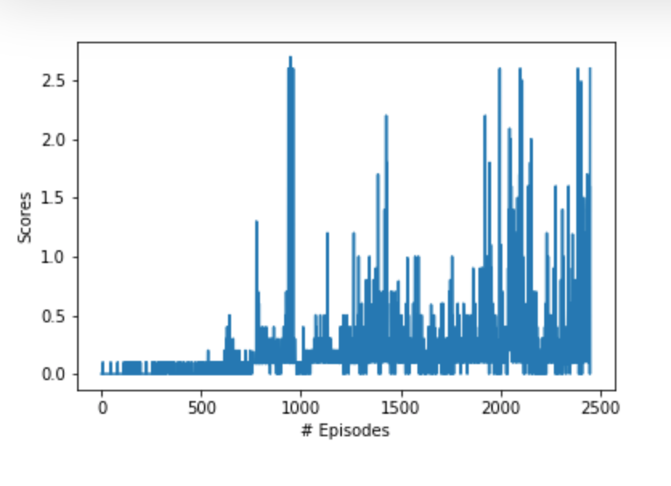

# Project 3: Collaboration and Competition

In this environment, two agents control rackets to bounce a ball over a net. If an agent hits the ball over the net, it receives a reward of +0.1. If an agent lets a ball hit the ground or hits the ball out of bounds, it receives a reward of -0.01. Thus, the goal of each agent is to keep the ball in play.

The observation space consists of 8 variables corresponding to the position and velocity of the ball and racket. Each agent receives its own, local observation. Two continuous actions are available, corresponding to movement toward (or away from) the net, and jumping.

The task is episodic, and in order to solve the environment, your agents must get an average score of +0.5 (over 100 consecutive episodes, after taking the maximum over both agents). Specifically,

After each episode, we add up the rewards that each agent received (without discounting), to get a score for each agent. This yields 2 (potentially different) scores. We then take the maximum of these 2 scores.
This yields a single score for each episode.
The environment is considered solved, when the average (over 100 episodes) of those scores is at least +0.5.
## Algorithm

The algorithm is Multi-Agent Deep Deterministic Policy Gradients (MADDPG) algorithm. I built it based on the algorithm implemented in Project 2 - same Actor and Critic, with shared information between agents. 

This project uses 20 agents and DDPG for agent training - 
- **Fixed targets**: two - one for actor, one for critic;
- **Soft Updates**: In DDPG, a soft update method is used to update the weight instead of DQN where all the weights from the local networks after a certain number of epochs;
- **Experience Replay**: Introduced to stabilize training. 

### Hyperparameters

| Hyperparameter                      | Value |
| ----------------------------------- | ----- |
| Replay buffer size                  | 1e4   |
| Batch size                          | 256   |
| $\gamma$ (discount factor)          | 0.99  |
| Overall time step                   | 3e-4  |
| $\tau$                              | 1e-3  |
| Actor Learning rate                 | 1e-4  |
| Critic Learning rate                | 1e-3  |
| Number of episodes                  | 3000  |
| Max number of timesteps per episode | 1000  |
| Leak for LeakyReLU                  | 0.01  |

## Results

  Agent is able to achieve average of 0.5 scores, the agent solved the environment at 2448 eposide. 

## Ideas for improvement

- Saw other projects using stochastic process in the agent, will be fun to explore as well.

  
